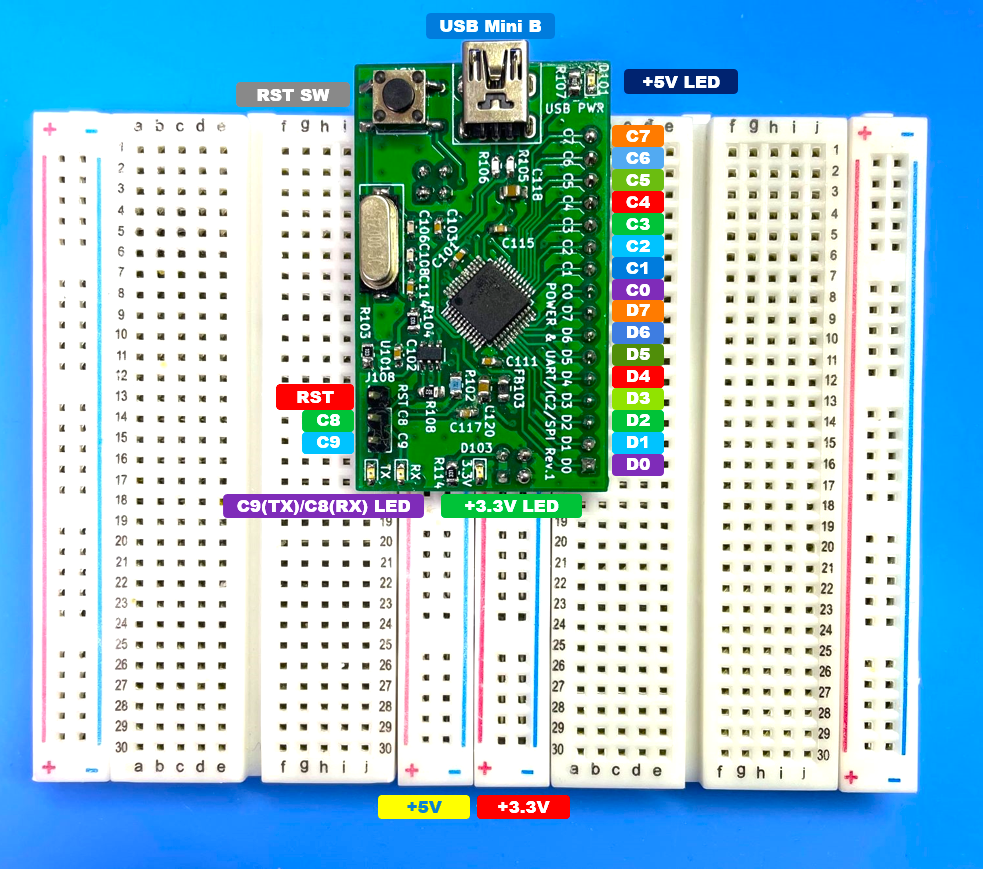

<div align="center">
  <h1><code>FTDI FT232H Breakout Board with Power Out</code></h1>
  <p>
    
  </p>
</div>

# FT232H Breakout Board with Power Out

This board provides an FTDI FT232H parallel port, UART/I2C/SPI interface,+5V power, and +3.3V power.

You can put this on a breadboard.

and 

You can use it with [PulseView](https://sigrok.org/wiki/PulseView) (Qt based logic analyzer).

Pulseview with this board can capture digital level from D0 - D7 port. But **Show Cursors** function shows time difference is not wrong. To correct this function, You need to rebuild PulseView Tools on Linux.

# Build PulseView For Linux
```bash
Ubuntu 22.04 LTS

$ sudo apt-get install git-core gcc make autoconf automake libtool

$ sudo apt-get install git gcc g++ make autoconf autoconf-archive \
  automake libtool pkg-config libglib2.0-dev libglibmm-2.4-dev libzip-dev \
  libusb-1.0-0-dev libftdi1-dev libieee1284-3-dev libvisa-dev nettle-dev libavahi-client-dev \
  libhidapi-dev check doxygen python3-numpy python3-dev python-gi-dev python-setuptools swig default-jdk

$ sudo apt-get install git-core g++ make cmake libtool pkg-config \
  libglib2.0-dev libboost-test-dev libboost-serialization-dev \
  libboost-filesystem-dev libboost-system-dev libqt5svg5-dev qtbase5-dev\
  qttools5-dev sdcc

$ git clone git://sigrok.org/sigrok-util
```

Patch divider value in ftdi-la driver.
```bash
$ git clone https://github.com/hnz1102/ft232hbrkout.git
$ cp ft232hbrkout/doc/patch.ftdi-la-api.linux sigrok-util/cross-compile/linux
$ cd sigrok-util/cross-compile/linux
$ patch < patch.ftdi-la-api.linux
```

Build
```bash
$ ./sigrok-cross-linux
$ cd sigrok-util/cross-compile/linux/build/libsigrok
$ ./autogen.sh
$ ./configure
$ sudo make install
```
# Build PulseView For Windows

```
To build for Windows, you have to rebuild code on Linux.

$ git clone git://sigrok.org/sigrok-util
$ git clone https://github.com/mxe/mxe.git mxe-git
$ git clone https://github.com/hnz1102/ft232hbrkout.git
$ cp ft232hbrkout/doc/patch.ftdi-la-api.mingw sigrok-util/cross-compile/mingw
$ cp ft232hbrkout/doc/patch.sigrok-cross-mingw.* igrok-util/cross-compile/mingw

$ cd mxe-git

$ patch -p1 < ../sigrok-util/cross-compile/mingw/libusb1_upgrade.patch 

$ sudo  ln -s /usr/bin/python3 /usr/bin/python

$ sudo  apt install p7zip-full autopoint intltool libtool lzip python3-mako ruby libtool-bin bison flex gperf libssl-dev nsis ruby-asciidoctor-pdf 

$ make MXE_TARGETS=i686-w64-mingw32.static.posix MXE_PLUGIN_DIRS=plugins/examples/qt5-freeze gcc glib libzip libusb1 libftdi1 hidapi glibmm qtbase qtimageformats qtsvg qttranslations boost check gendef libieee1284 qtbase_CONFIGURE_OPTS='-no-sql-mysql'

$ cd sigrok-util/cross-compile/mingw
$ patch < patch.sigrok-cross-mingw.1
```

First build with normal.
```bash
$ ./sigrok-cross-mingw
```

Patch divider value in ftdi-la driver.
```bash
$ patch < patch.ftdi-la-api.mingw
```

Second build with patch.
```bash
$ patch < patch.sigrok-cross-mingw.2
$ ./sigrok-cross-mingw
```

After the build is successful, you can use the Pulseview Installer for Windows with the driver fixed.
```
sigrok-util/cross-compile/mingw/build_release_32/pulseview/contrib/pulseview-0.5.0-git-3903edb-installer.exe
```

## LICENSE
Hardware Schematic documents are licensed under CC-BY-SA V4.0.